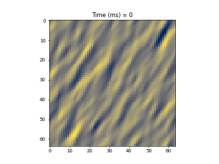

# Stage M2a Neurosciences
# English Below

Code source pour un stage de seconde année de Master de Neurosciences avec [Laurent Perrinet](https://invibe.net/LaurentPerrinet/HomePage).

  
# Organisation :
### Code :
Le code est organisé sous forme de notebooks interactifs, entièrement documentés, qu'il est possible de modifier pour pouvoir s'approprier la dynamique du réseau. 

Pour un coup d'oeil rapide, les notebooks les plus complets sont ceux avec le préfixe FINAL_

Pour voir en détail le développement du code, tout les notebooks expérimentaux se trouvent dans le dossier /dev

### Figures :
Toutes les figures se trouvent dans le dossier /figs, notamment certaines non inclus dans le rapport final.

Pour se faire une meilleure idée des processus dynamiques, quelques animations :
#### MotionClouds
La structure des MotionClouds (MC) est proche de celle d'un grating, tout en imitant les textures naturelles, rajoutant du bruit et du réalisme dans l'entrée, ce qui constitue un bon compromis entre un stimulus entièrement paramétrique et une image naturelle. Ce sont des caractéristiques difficiles à apprécier dans une figure statique, mais tout à fait visible dans cette animation (paramètres 
&theta; = &pi; / 3 , B &theta; = 15°)  :

#### Gradient de performance
Pour visualiser le rôle de chacun des paramètres du réseau, une manière de représenter l'espace multidimensionnel des paramètres est de faire des projections 3D de paramètres 2 à 2, en utilisant la performance du réseau comme troisième axe. Par exemple, dans le cas de la constante de temps tau de la STDP et de son coefficient A*, on obtient la carte suivante : 

On peut alors sélectionner les paramètres qui sont optimaux ET biologiquement plausibles

# Dépendances :
En plus de l'installation de Python3, certains packages sont requis pour pouvoir faire tourner le code. Pour simplifier toute l'installation et éviter de devoir télécharger les librairies de base, je vous conseille d'utiliser directement [Anaconda](https://www.anaconda.com/download/), qui regroupe des packages par défaut. 

Il faudra quand même installer :
### Les simulateurs :
* [PyNN](https://pypi.org/project/PyNN/), le meta-simulateur utilisé pour la construction du réseau
* [NEST](http://www.nest-simulator.org/installation/), le moteur sous-jacent à PyNN, un peu compliqué à installer
* [Brian](https://brian2.readthedocs.io/en/stable/introduction/install.html), un autre moteur sous-jacent, utilisé dans un notebook de développement au début mais inutilisé par la suite

### Les générateurs de stimuli :
* [LogGabor](https://pypi.org/project/LogGabor/), pour faire des [Gabors](https://en.wikipedia.org/wiki/Log_Gabor_filter) dans nos stimuli
* [MotionClouds](http://www.motionclouds.invibe.net/install.html), les stimuli dynamiques qui ressemblent a des textures naturelles
* [LazyArray](https://lazyarray.readthedocs.io/en/latest/installation.html), une forme de donnée particulière qui optimise l'usage des ressources de l'ordinateur
* [Lmfit](https://pypi.org/project/lmfit/), un package pour *fitter* des fonctions aux données, notamment pour les distributions gaussiennes ici

----------------------------------------------------------------
# MSc Neuroscience internship
Source code for a second year internship in a Master of Neuroscience degree, with [Laurent Perrinet](https://invibe.net/LaurentPerrinet/HomePage)

# Repository organization :
#### Code :
The code is organized in the form of interactive, fully documented Jupyter notebooks, which can be modified to capture the dynamics of the network. 

For a quick look, the most complete notebooks are those with the prefix FINAL_

To see in detail the development of the project, all experimental notebooks are located in the /dev/ folder

#### Figures :
All figures are in the /figs/ folder, including some not included in the final report (in French, sorry).

To get a better idea of the dynamic processes involved in the project, some animations are shown in the French figures section above

# Dependencies :
In addition to installing Python3, some packages are required to run the code. To simplify the entire installation and avoid having to download the basic libraries, I advise you to use [Anaconda](https://www.anaconda.com/download/), which contains default packages. 

It will still be necessary to install:
#### The simulators:
* [PyNNN](https://pypi.org/project/PyNN/), the meta-simulator used for the building of the network
* [NEST](http://www.nest-simulator.org/installation/), the simulation engine underlying PyNNN, a little complicated to install
* [Brian](https://brian2.readthedocs.io/en/stable/introduction/install.html), another underlying engine, used in a development notebook at first but unused later

#### Stimuli generators:
* [LogGabor](https://pypi.org/project/LogGabor/), to make [Gabors](https://en.wikipedia.org/wiki/Log_Gabor_filter) in our stimuli
* [MotionClouds](http://www.motionclouds.invibe.net/install.html), dynamic stimuli that look like natural textures
* [LazyArray](https://lazyarray.readthedocs.io/en/latest/installation.html), a special form of data that optimizes the use of computer resources
* [Lmfit](https://pypi.org/project/lmfit/), a package for *fitting* functions to data, especially for Gaussian distributions here
